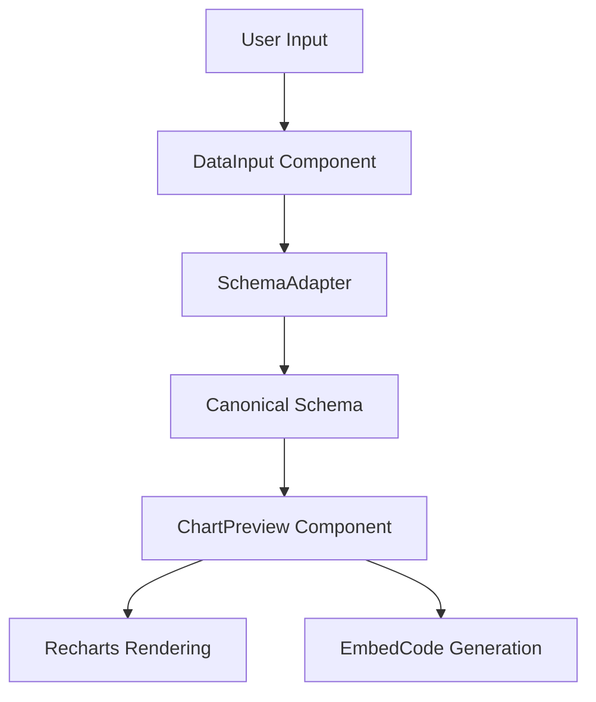

# Architecture Documentation

## Overview
Chart Easy is a web application built with React, Vite, and Shadcn UI. It allows users to create, customize, and embed charts by providing data in various formats (CSV, JSON, etc.).

## System Architecture



### Key Components

1.  **DataInput**: Provides an interface for users to paste or upload data. It handles raw parsing of CSV and JSON.
2.  **SchemaAdapter**: A critical layer that normalizes different data structures into a strict canonical schema.
    
    ```mermaid
    graph TD
        subgraph Inputs
            RAW[Raw Text/CSV] --> PAR[Parser]
            JSON[JSON Object]
        end

        PAR --> DET[Format Detector]
        JSON --> DET

        subgraph Normalization Flow
            DET -->|Parallel Arrays| ADA1[Parallel Array Adapter]
            DET -->|Array of Objects| ADA2[Object Array Adapter]
            DET -->|Multi-Series| ADA3[Multi-Series Adapter]
            
            ADA1 & ADA2 & ADA3 --> TRANS[Transformation Layer]
            TRANS --> VAL[Canonical Validator]
        end

        VAL --> |Success| CS[Canonical Schema]
        VAL --> |Error| ERR[Ambiguity/Error Handler]
    ```
3.  **ChartPreview**: Consumes the canonical data and renders interactive charts using the Recharts library. It manages chart types and visual customizations.
4.  **EmbedCode**: Generates the necessary HTML/JS to embed the created chart into other websites.

## Data Flow
1.  **Capture**: User enters data in `DataInput`.
2.  **Normalize**: `SchemaAdapter` transforms input into `CanonicalSchema`.
3.  **Preview**: `ChartPreview` maps `CanonicalSchema` to Recharts data props.
4.  **Export**: `EmbedCode` exports the configuration for external use.

## Technical Stack
- **Framework**: React 18
- **Build Tool**: Vite
- **Styling**: Tailwind CSS + Shadcn UI
- **Visualization**: Recharts
- **State Management**: TanStack Query (for data fetching/caching)
